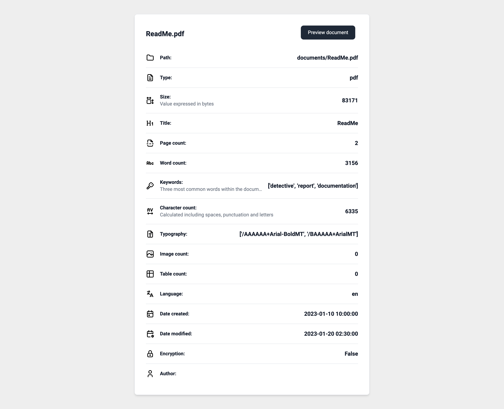
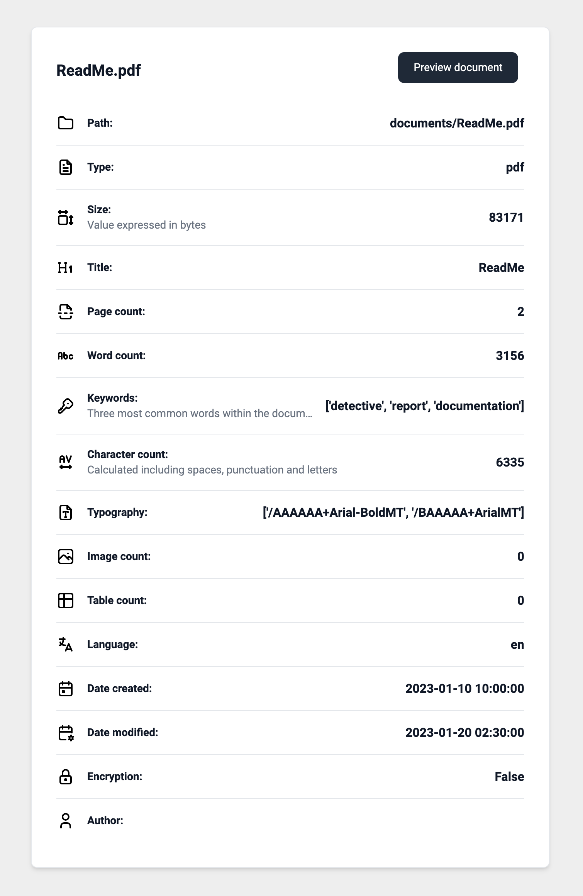

<!-- Document Detective -->
<br />
<h1 align="center">Document Detective</h3>

<div align="center">
    
</div>
  
<br />

<!-- ABOUT -->
## About

<div align="justify">

Document Detective is a software tool prototype that detects, extracts, and generates reports on metadata and insights from ``PDF`` and ``DOCX`` documents. Generated reports provide a comprehensive overview of the metadata properties available in ``HTML``, ``JSON``, and ``CSV`` formats, enabling users to quickly view and analyze the structure and content of the documents. Document Detective is created to be easily integrated into the user's existing workflow and development pipeline, as the reports can serve for further analysis and information retrieval, document indexing and processing tasks, document-structuring management systems, content extraction, data engineering, governance and analytics, quality control, archiving purposes, etc. 

Document Detective analyzes and extracts the following metadata information from PDF and DOCX documents:

- ``Name``
- ``Path``
- ``Type``
- ``Size``
- ``Title``
- ``Page count``
- ``Word count``
- ``Keywords``
- ``Typography``
- ``Character count``
- ``Image count``
- ``Table count``
- ``Language``
- ``Creation date & time``
- ``Modified date & time``
- ``Encryption``
- ``Author``

</div>

<!-- Detective -->
## Detective

<div align="justify">

The Detective is written in Python code and is used to detect, extract, and generate reports on various metadata and insights from PDF and DOCX documents. It consists of two individual Python codes — ``PDF.py`` and ``DOCX.py``, each responsible for its own detection, extraction and generation of the reports based on the document type, and a ``detective.py`` document responsible for running the Detective. The Detective's mode of operation is via the **Command-Line Interface (CLI)**. 

### CLI (Command-Line Interface)

The CLI operating mode of the Detective is designed as a text-based interface working with the command-line tools. Users interact with the Detective by entering commands and parameters directly into a terminal or command prompt. The CLI mode provides a streamlined and efficient way to utilize the Detective's functionality, allowing users to quickly execute tasks, extract metadata, and generate reports using a series of command-line instructions.

Example of the Detective's Report generation workflow:

```engine='python'
Enter the relative document path (documents/document.pdf): documents/ReadMe.pdf
Enter the document type (pdf/docx): pdf
Generate CSV Report? (y/n): y
Generate JSON Report? (y/n): y
Generate HTML Report? (y/n): y
HTML Report generated in '/reports/report.html'
JSON Report generated in '/reports/report.json'
CSV Report generated in '/reports/report.csv'
```

</div>

<!-- Report -->
## Report

<div align="justify">

The Report is a comprehensive overview of metadata properties available for viewing and further usage in ``HTML``, ``JSON``, and ``CSV`` formats. The Reports are generated and saved in the ``reports`` folder within the root directory.

Example of the Report in ``HTML``:

> **_Note:_**  
> The HTML report provides a ``Preview document`` button to preview the document in the browser.

</div>

<div align="left">
    
</div>

Example of the Report in ``JSON``:

```json
{
    "document": {
        "name": "ReadMe.pdf",
        "path": "documents/ReadMe.pdf",
        "type": "pdf",
        "size": 83171,
        "title": "ReadMe",
        "page_count": 2,
        "word_count": 3156,
        "keywords": [
            "detective",
            "report",
            "documentation"
        ],
        "character_count": 6335,
        "typography": [
            "/AAAAAA+Arial-BoldMT",
            "/BAAAAA+ArialMT",
        ],
        "image_count": 0,
        "table_count": 0,
        "language": "an",
        "creation_date": "2023-01-10 10:00:00",
        "modified_date": "2023-01-20 02:30:00",
        "encryption": false,
        "author": ""
    }
}
```

Example of the Report in ``CSV``:

```csv
Name,Path,Type,Size,Title,Page count,Word count,Keywords,Character count,Typography,Image count,Table count,Language,Creation date,Modified date,Encryption,Author
ReadMe.pdf,documents/ReadMe.pdf,pdf,83171,ReadMe,2,3156,"['detective', 'report', 'documentation']",6335,"['/AAAAAA+Arial-BoldMT', '/BAAAAA+ArialMT']",0,0,en,2023-01-10 10:00:00,2023-01-20 02:30:00,False
```

<!-- Documentation -->
## Documentation

<div align="justify">
Document Detective is configured to be used locally to ensure flexibility, scalability, and control over the user's environment and data. Using it locally allows customization and extension of the Document Detective's functionality and capabilities to better fit the user's needs. 

<br />

1. Git clone or download the project zip folder
2. Open the cloned project or the downloaded folder
3. Navigate to the project root directory
4. Install project dependencies 
    - ``pip install -r lib/requirements.txt``
5. Add your PDF and/or DOCX documents into the ``documents`` folder
6. Open and run the ``detective.py`` document
7. Follow the generated instructions within the terminal:

    - Enter the relative document path (documents/document.pdf):
    - Enter the document type (pdf/docx):
    - Generate CSV report? (y/n): 
    - Generate JSON report? (y/n): 
    - Generate HTML report? (y/n): 

8. The report is generated
9. Open the report in the ``reports`` folder
10. The report is ready for viewing and further usage

</div>

<!-- TECHNOLOGY -->
## Technology

* [![python][python]][python-url]

<!-- CONTACT -->
## Contact

[![linkedin][linkedin]][linkedin-url]
[![email][email]][email-url]

<!-- MARKDOWN LINKS & IMAGES -->
<!-- https://www.markdownguide.org/basic-syntax/#reference-style-links -->
[linkedin]: https://img.shields.io/badge/-LinkedIn-black.svg?style=for-the-badge&logo=linkedin&colorB=555
[linkedin-url]: https://www.linkedin.com/in/jurajstefanic/
[email]: https://img.shields.io/badge/email-555?style=for-the-badge&logo=gmail&logoColor=white
[email-url]: mailto:jurajstefanic@outlook.com
[python]: https://img.shields.io/badge/python-3776AB?style=for-the-badge&logo=python&logoColor=white
[python-url]: https://www.python.org/